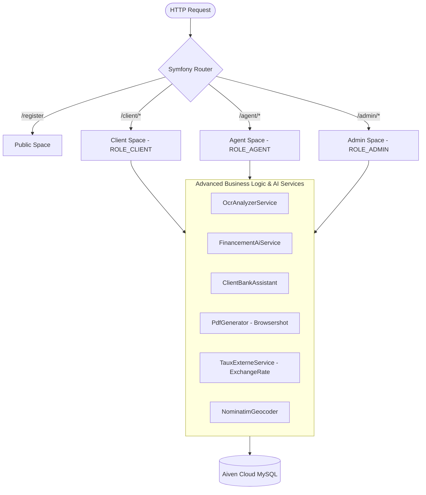
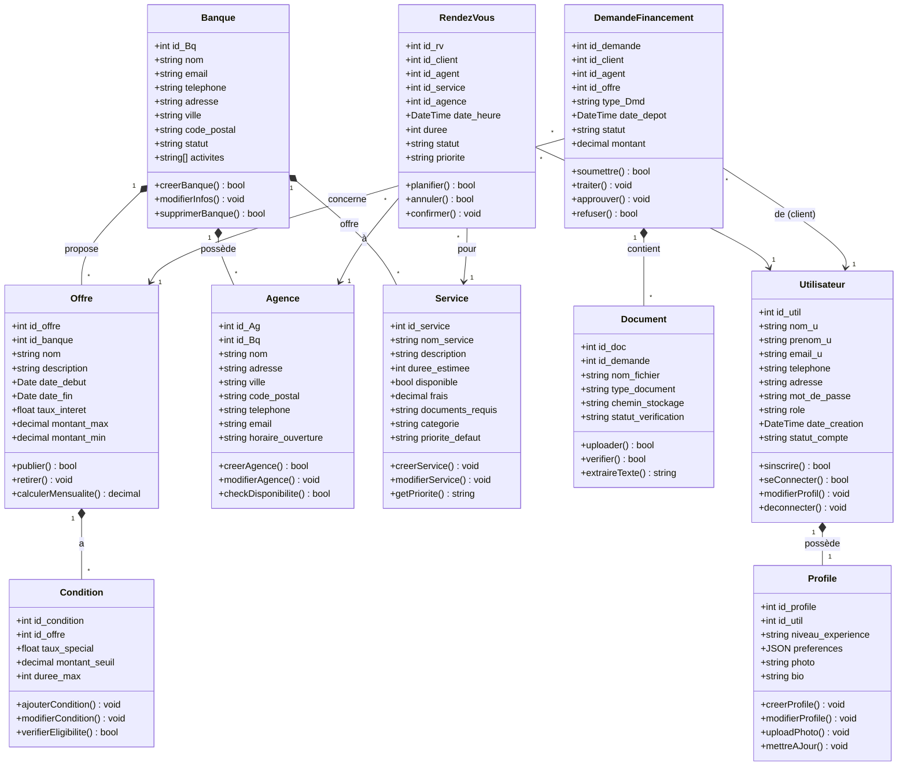

# 🚀 Beeline Banking Platform

An enterprise-grade, state-of-the-art digital banking platform designed to redefine customer interactions and back-office banking operations. Powered by a robust **Symfony 6.4 LTS** architecture, **Aiven Cloud Databases**, and advanced **Artificial Intelligence**, the platform provides an interactive ecosystem segmented into three dedicated workspaces: **Client**, **Bank Agent**, and **Platform Administrator**.

---

## 🔒 Private Repository Notice & Contact Info

> [!IMPORTANT]
> **This repository is a showcase portfolio.** For intellectual property reasons, the source code is private. The screenshots and documentation below demonstrate the application's architecture, UI design, and advanced logic.
>
> **Interested in the code, a live demo, or a detailed walkthrough?**
> Please contact me directly to schedule a private showcase.

---

## 🏗️ Architectural Topology

The project follows a clean **Separation of Concerns (SoC)** model. Logic is isolated into specific spaces using Symfony Routing and Controller namespaces:

### 🗂️ Entity Class Schema (UML)

The relational schema of the entities is designed to support the 5 core banking business domains:

---

## 🛠️ Advanced Business Logic ("Métiers Avancés") & AI Integrations

The system's core capabilities are divided into five operational modules, each containing advanced business rules and intelligent automations:

### 1. 👤 User & Profile Workspace (`Utilisateur` & `Profile`)
Manages account registration, role-based onboarding, and security filters.
* **Hybrid Spam Protection (reCAPTCHA v2/v3):** Integrates an intelligent verification loop. Form submissions default to **reCAPTCHA v3** (background scoring). If the score falls below a threshold (`0.3`) indicating potential bot behavior, the page dynamically injects a fallback **reCAPTCHA v2** checkbox verification.
* **Voice-Assisted Registration (NLP Parser):** Allows users to register using unstructured text or voice-to-text dictation. An AI pipeline (`google/flan-t5-large` on Hugging Face or `llama-3.1-8b-instant` via Groq) extracts names, emails, and phone numbers. It handles spelling vocalizations (e.g., converting "arrobase" to `@` and "point" to `.`). A native PHP regular expression parser is integrated as a fail-safe backup.
* **Agent Credentials Validation workflow:** Bank agents register with custom credentials, select branches, and provide corporate data. Their accounts are initialized as `pending` and restricted from the agent workspace until a Platform Administrator manually reviews and approves the application.
* **Extended Dynamic Profiles (1-to-1 Association):** Stores user experience level, financial preferences, and bio info, which are used to personalize offer recommendations.

### 2. 💰 Financing & Document Verification (`Financement` & `Document`)
An automated document checking and credit scoring pipeline that processes loan applications.
* **Dual-Engine OCR Analysis (`ocr.space`):** When a client uploads supporting documents (CNI, salary slip, utility bill), the system calls the OCR API in French (`fre`). A custom cleanup engine corrects typical OCR errors (e.g., correcting number typos like `ooo` to `000`, stripping currency symbols, and processing numbers with commas).
* **Document Completeness Engine:** Automatically validates that the uploaded documents match the requirements for the selected loan type (e.g., Crédit Auto requires CNI, salary slip, vehicle quote, and utility bill).
* **Cross-Document Coherence Analysis:** Compares OCR-extracted data against database records:
  * **CNI:** Validates the Tunisian National Identity Card format (exactly 8 digits) and verifies the cardholder's name.
  * **Salary Slip:** Extracted net and gross incomes are verified, and the date is checked to ensure the document is under 3 months old (`\DateTime` delta comparison).
  * **Utility Bill:** Extracts address text and validates residency keywords.
* **Document Scoring System (Out of 100):** Points are allocated as follows:
  * **30 pts:** Complete set of required documents.
  * **30 pts:** OCR validation success.
  * **20 pts:** Extraction of essential fields (CNI card number, net income, slip date, utility address).
  * **20 pts:** Internal coherence check.
* **Explainable AI (XAI) Justification:** Uses Groq's LLM (`llama-3.1-8b-instant`) to analyze the score sheet and generate a structured, professional decision summary (Auto-Approve, Request Correction, or Auto-Reject) limited to four lines. It explains the exact reasons for the decision and recommends next steps.
* **AI Summary Tool:** Converts complex, multi-page financial descriptions into bulleted summaries for bank agents to read.
* **AI Audit PDF Export:** Generates printable PDF summaries of the AI scoring process and history using **Dompdf** or **Browsershot**.

### 3. 📊 Interactive Credit Simulator & Offers (`Offre` & `Conditions`)
A simulation tool that matches clients with active banking promotions and calculates payments.
* **Multi-Tier Interest Rates:** Supports fixed, variable, and mixed rate simulations:
  * **Fixed:** Standard constant monthly payments.
  * **Variable:** Simulates dynamic interest rate adjustments over time (e.g., +0.3% after month 24, and a maximum decrease of 0.2% after month 60).
  * **Mixed:** Combines a 5-year fixed rate phase with a variable rate phase.
* **Amortization Schedule Generator:** Computes monthly principal and interest breakdowns, along with the remaining balance for the first 12 months.
* **TAEG Calculator:** Computes the Annual Percentage Rate based on monthly payments and loan terms.
* **Live Exchange-Rate Adjusted Interest Rates:** Fetches live currency exchange rates (EUR→USD via ExchangeRate API, USD→EUR via exchangerate.host) using cached Symfony HttpClient requests (TTL 1 hr) and dynamically adjusts interest rates based on currency changes.
* **Ollama Credit Chatbot:** A guided chatbot using a local Ollama model (`mistral` or `llama3.2`) that queries credit type, duration, age, and rate, validates inputs (custom funny messages for ages or invalid months), finds the best matching bank offer, or calculates the nearest matching alternative (heuristics gap formula) recommending specific changes (e.g., "increase duration to XX months", "decrease amount to YY TND").
* **Automated Email Notifications:** Automatically emails HTML alerts (`TemplatedEmail`) to all clients of the associated bank when a new offer is published.
* **One-Click Duplication:** Allows bank agents to duplicate existing offers and terms to quickly deploy updated deals.

### 4. 💼 Banking Services Management (`Service`)
Maintains the catalog of services provided by each branch.
* **Dynamic Search & Filtering:** Offers AJAX-driven searches by keywords and categories.
* **Real-time Status Toggle:** Uses an AJAX route (`/toggle-status/{id}`) to activate or deactivate services on the fly without refreshing the page.

### 5. 📅 Smart Appointment Scheduling (`RendezVous`)
Connects clients with banking agents while optimizing branch resource allocation.
* **Smart Counter (Guichet) Allocation:** Checks for timeslot overlaps among existing appointments at a branch (`StartA < EndB AND EndA > StartB`) and automatically assigns the client to an available counter.
* **Secure QR Code Tickets:** Generates a PNG QR Code containing the ticket reference, client name, timeslot, and counter number.
* **ICS Calendar Export:** Generates standard `.ics` calendar files so clients can import their appointments directly into Google Calendar, Outlook, or Apple Calendar.
* **Visio-Conference Integration:** Scans service categories and descriptions for remote keywords (e.g., `en ligne`, `visio`, `video`, `distance`). If detected, it creates a Jitsi Meet video room (`https://meet.jit.si/beeline-rdv-{rdvId}-{clientId}`) and embeds the link in the confirmation email.
* **Agent CRM Copilot Chatbot:** An AI chatbot for agents powered by Gemini 2.5 Flash. It reads active appointments, interprets natural language commands (e.g., "Cancel appointment for client X", "Confirm appointment Y"), executes database state updates, and replies in Markdown-formatted HTML.

---

## 🎨 Workspace Breakdowns

The application is split into three workspaces, styled with modern CSS layouts:

### 1. Client Space (`ROLE_CLIENT`)
* Interactive dashboard displaying active accounts, finances, and upcoming appointments.
* AI Credit Simulator Chatbot with live offers matching.
* Appointment booking module with PDF tickets and ICS calendar downloads.
* Loan application wizard with document uploads and OCR checking.
* AI decision history panel.

### 2. Agent Space (`ROLE_AGENT`)
* CRM dashboard showing branch statistics and today's calendar.
* Interactive calendar (FullCalendar integration) synced via a JSON API.
* AI Copilot interface to manage appointments through text commands.
* Service catalog editor with AJAX status controls.
* Financing dashboard with stacked bar charts.
* Loan request overview with AI summaries.
* Offers manager with one-click duplication and automated email notifications.

### 3. Admin Space (`ROLE_ADMIN`)
* System dashboard showing user distributions, active branches, and service stats.
* Chart.js analytics of platform transactions and appointments.
* User account panel supporting approvals, rejections, blocking, and unblocking.
* Agent application queue.
* Global list of banking offers, services, and loan requests.

---

## 🖼️ Screenshots

> 🎯 Live screenshots from the production-ready platform — three full workspaces in action.

---

### 🔐 Authentication & Smart Registration

<table>
  <tr>
    <td align="center" width="50%">
      
       <b>🔑 Login — Multi-Provider OAuth (Google · GitHub · Facebook)</b>
    </td>
    <td align="center" width="50%">
      
       <b>📝 Smart Registration — reCAPTCHA v2/v3 Protected</b>
    </td>
  </tr>
  <tr>
    <td align="center" width="50%">
      
       <b>🎙️ Voice-Assisted Onboarding — NLP Registration Parsing</b>
    </td>
    <td align="center" width="50%">
      
       <b>📧 Email Activation & Account Verification Flow</b>
    </td>
  </tr>
</table>

---

### 🏠 Client Space — Dashboard & Banking Hub

<table>
  <tr>
    <td align="center" width="50%">
      
       <b>🏠 Client Dashboard — Accounts, Finances & Upcoming Appointments</b>
    </td>
    <td align="center" width="50%">
      
       <b>🏦 Banking Offers Catalog — Filtered, Sorted & Interactive</b>
    </td>
  </tr>
</table>

---

### 🤖 AI Credit Chatbot — Client Banking Assistant

<table>
  <tr>
    <td align="center" width="50%">
      
       <b>🤖 AI Credit Simulator (Ollama · Mistral · Llama 3.2)</b>
    </td>
    <td align="center" width="50%">
      
       <b>💡 Live Offer Matching & Credit Recommendations</b>
    </td>
  </tr>
</table>

---

### 💸 Loan Financing — AI-Powered Credit Scoring

<table>
  <tr>
    <td align="center" width="50%">
      
       <b>📋 Multi-Step Loan Application Wizard</b>
    </td>
    <td align="center" width="50%">
      
       <b>🔍 Document Upload + AI OCR Verification (Groq Vision)</b>
    </td>
  </tr>
  <tr>
    <td align="center" width="50%">
      
       <b>🧠 Explainable AI Credit Decision — Score + Justification</b>
    </td>
    <td align="center" width="50%">
      
       <b>📜 AI Decision History — Full Audit Trail</b>
    </td>
  </tr>
</table>

---

### 📅 Smart Appointment Scheduling — Rendez-Vous

<table>
  <tr>
    <td align="center" width="50%">
      
       <b>📅 Intelligent Booking — Smart Counter (Guichet) Allocation</b>
    </td>
    <td align="center" width="50%">
      
       <b>🎫 QR Code Ticket Generation + ICS Calendar Export</b>
    </td>
  </tr>
  <tr>
    <td align="center" width="50%">
      
       <b>📹 Auto Jitsi Visio-Conference Room for Remote Appointments</b>
    </td>
    <td align="center" width="50%">
      
       <b>🗓️ My Appointments — Download PDF, Cancel & Modify</b>
    </td>
  </tr>
</table>

---

### 🧑‍💼 Agent Space — CRM Dashboard & AI Copilot

<table>
  <tr>
    <td align="center" width="50%">
      
       <b>🏢 Agent CRM Dashboard — Branch Stats & Today's Calendar</b>
    </td>
    <td align="center" width="50%">
      
       <b>📆 FullCalendar Integration — Real-Time Appointment Sync</b>
    </td>
  </tr>
  <tr>
    <td align="center" width="50%">
      
       <b>🤖 Gemini 2.5 Flash CRM Copilot — NLP Appointment Control</b>
    </td>
    <td align="center" width="50%">
      
       <b>💰 Financing Dashboard — Stacked Bar Charts & Status Overview</b>
    </td>
  </tr>
</table>

---

### 🧰 Agent Space — Offers, Services & Rate Management

<table>
  <tr>
    <td align="center" width="50%">
      
       <b>🏷️ Offers CRUD — One-Click Duplication & Email Notifications</b>
    </td>
    <td align="center" width="50%">
      
       <b>📈 External Interest Rate Sync — Live Market Data Integration</b>
    </td>
  </tr>
</table>

---

### 🛡️ Admin Space — Platform Governance & Analytics

<table>
  <tr>
    <td align="center" width="50%">
      
       <b>🛡️ Admin Overview — User Distribution & Platform Metrics</b>
    </td>
    <td align="center" width="50%">
      
       <b>📊 AI-Generated Analytics Report (Chart.js + Gemini Insights)</b>
    </td>
  </tr>
  <tr>
    <td align="center" width="50%">
      
       <b>👥 User Management — Approve · Block · Reject · Role Assignment</b>
    </td>
    <td align="center" width="50%">
      
       <b>📋 Agent Application Queue — Review & Onboard Banking Agents</b>
    </td>
  </tr>
</table>

---

> 📌 **And more features inside...** The source code is private. For a full demo, deep-dive walkthrough, or collaboration request — please use the contact details below.

---

## 💻 Tech Stack & Libraries

* **Core Framework:** Symfony 6.4 LTS (with Twig & AssetMapper)
* **PHP Version:** PHP >= 8.1
* **Database:** MySQL / PostgreSQL hosted on the **Aiven Cloud Platform**
* **PDF Engine:** **Dompdf** & **Spatie Browsershot** (Headless Chrome via Node.js)
* **QR Engine:** **Endroid QR Code 6**
* **Security:** Hybrid reCAPTCHA v2/v3, Symfony Security Bundle
* **Social Auth:** KnpUniversity OAuth2 Client (Google, GitHub, Facebook)
* **Caching:** Symfony Cache Interface (Redis/Filesystem)
* **Pagination:** KNP Paginator
* **AI Models:**
  * **Gemini 2.5 Flash:** CRM Copilot, Branch Checklists, Admin Analytics
  * **Groq Llama-3.1-8b-instant:** Explainable AI credit scoring, OCR verification, NLP registration parsing
  * **Ollama (Mistral / Llama 3.2):** Credit Chatbot
  * **Hugging Face (flan-t5-large):** NLP Registration Parsing

---

## 👨‍💻 Author & Contact

This project showcases next-generation digital banking features built with modern web technologies.

* **Developer:** Mehdi Mejri
* **Email:** mehdimejri15@gmail.com
* **LinkedIn:** www.linkedin.com/in/mehdi-mejri

*Feel free to reach out for project inquiries, collaborations, or code reviews.*

 Made with ❤️ by <a href="https://github.com/Mejri-Mehdi">Mejri Mehdi</a> 

